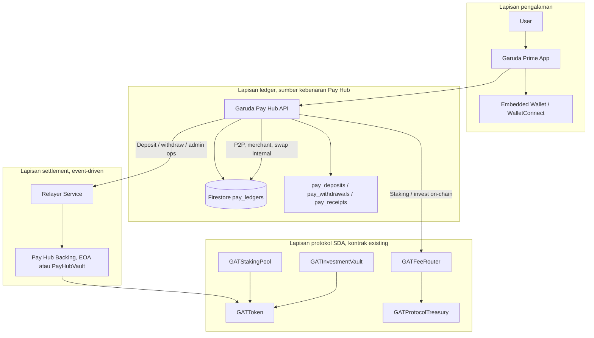

# ADR-001: Hybrid Enterprise Architecture, Garuda Pay Hub + SDA Smart Contracts

| Field | Value |
|-------|--------|
| **Status** | Diterima (Accepted) |
| **Tanggal** | 2026-05-31 |
| **Konteks** | Garuda Prime Fintech App, Pay Hub off-chain + protokol GAT on-chain Sidra |

## Ringkasan keputusan

Garuda Prime memakai arsitektur **hybrid**:

1. **Firestore** = sumber kebenaran saldo Pay Hub (instan, P2P, merchant).
2. **Relayer / server treasury** = settlement on-chain terbatas (deposit, withdraw, produk protokol).
3. **Smart contract SDA** = token, treasury protokol, fee router, staking, investment vault, **bukan** ledger per tap pembayaran.

Setiap pembayaran QR/P2P **tidak wajib** satu transaksi blockchain. Chain dipakai untuk backing, audit, dan produk on-chain.

---

## Diagram alur

### Alur utama (disarankan)



### Perbandingan dengan alur yang perlu dihindari

```
❌ User → Firestore → SC → selesai   (setiap pembayaran = 1 tx chain)
✅ User → Firestore selesai → SC hanya untuk backing / produk / audit berkala
```

---

## Pemetaan lapisan → kode & data

| Lapisan | Tanggung jawab | Implementasi saat ini |
|---------|----------------|------------------------|
| **Garuda Prime** | UI, auth, KYC | `src/app/`, `src/lib/payhub/` |
| **Pay Hub API** | Aturan bisnis, fee, idempotency | `server/payLedgerCore.ts`, `server/payAdminOpsCore.ts`, `server/apiRouter.ts` |
| **Firestore Ledger** | `gatBalance`, `sdaBalance` per `uid` | Koleksi `pay_ledgers` |
| **Settlement** | Verifikasi deposit, kirim withdraw | `depositPayHubGat`, `withdrawPayHubGat`, `sendGatOnSidra` |
| **Relayer (target)** | Antrian tx, gas policy, retry | *Belum service terpisah*, logic di server |
| **Embedded Wallet (target)** | Alamat user, signing | WalletConnect / provider di client |
| **SC Protokol** | Token, fee, treasury bucket, stake/vault | `contracts/src/*.sol` |

---

## Variabel environment per lapisan

### A. Pay Hub (app + server), ledger & API

| Variabel | Lapisan | Catatan |
|----------|---------|---------|
| `VITE_PAY_HUB_API_URL` | App | Endpoint API Pay Hub |
| `FIREBASE_*` / service account | Server | Firestore admin |
| `ADMIN_PAY_OPS_SECRET` | Admin ↔ App | Ops withdraw/recredit tanpa key di admin |

### B. Pay Hub backing (settlement on-chain), **bukan SC treasury**

| Variabel | Lapisan | Catatan |
|----------|---------|---------|
| `PROTOCOL_OWNER_PRIVATE_KEY` | Server / Relayer | Menandatangani transfer GAT withdraw & operasi hot wallet |
| `PROTOCOL_OWNER_ADDRESS` | Audit | Harus match dengan signer |
| `VITE_GAT_TOKEN_ADDRESS` | App + Server | Kontrak GAT |
| `VITE_GAT_TREASURY_ADDRESS` | **Hati-hati** | Jika di-set ke alamat **kontrak** SC treasury, deposit Pay Hub mengarah ke SC, pisahkan dengan alamat EOA backing |

**Rekomendasi env terpisah (fase 2):**

```bash
# Pay Hub float, EOA atau PayHubVault
VITE_PAY_HUB_BACKING_ADDRESS=0x...
PAY_HUB_RELAYER_PRIVATE_KEY=0x...

# Protocol, kontrak treasury
VITE_GAT_PROTOCOL_TREASURY_ADDRESS=0x4d81A00c4D9f775Ecf2d660289EFea9bEDF68a4f
```

Saat ini `depositTreasuryAddress()` di `server/payLedgerCore.ts` memakai `VITE_GAT_TREASURY_ADDRESS` atau derivasi dari private key, dokumentasikan secara eksplisit di Vercel agar tidak tertukar.

### C. Smart contract protokol (Sidra)

| Variabel | Kontrak | Deploy (referensi) |
|----------|---------|-------------------|
| `VITE_GAT_TOKEN_ADDRESS` | GATToken | `0x604cB63465B8785eE3aD0cFc506125D28be42d07` |
| `VITE_GAT_TREASURY_ADDRESS` | GATProtocolTreasury | `0x4d81A00c4D9f775Ecf2d660289EFea9bEDF68a4f` |
| `VITE_GAT_FEE_ROUTER_ADDRESS` | GATFeeRouter | `0x49ec70b09657D6CbeCf55f766B40aF6e2Ce1ACBf` |
| `VITE_GAT_STAKING_POOL_ADDRESS` | GATStakingPool | `0x4511…` (lama, tanpa recover) |
| `VITE_GAT_INVESTMENT_VAULT_ADDRESS` | GATInvestmentVault | `0x59af…` (lama, tanpa recover) |
| `VITE_SIDRA_RPC_URL` / `VITE_SIDRA_CHAIN_ID` | RPC | `97453` |

Lihat private deploy snapshots under `contracts/deployments/` (local ops tree) for address details.

### D. Relayer & embedded wallet (rencana)

| Variabel | Fase | Catatan |
|----------|------|---------|
| `RELAYER_SERVICE_URL` | 2 | Service terpisah dari Vercel serverless |
| `RELAYER_MAX_GAT_PER_TX` | 2 | Policy |
| `EMBEDDED_WALLET_PROVIDER_*` | 4 | MPC / AA vendor |

---

## Pemakaian ulang smart contract yang sudah ada

| Kontrak | Pakai lagi? | Peran di hybrid |
|---------|-------------|-----------------|
| **GATToken** | ✅ Ya | Token resmi; supply cap |
| **GATProtocolTreasury** | ✅ Ya | Fee bucket protokol, buyback, distribusi, **bukan** float Pay Hub harian |
| **GATFeeRouter** | ✅ Ya | Fee on-chain (stake, invest, withdraw SC) |
| **GATStakingPool** | ⚠️ Alamat baru | Hanya untuk produk staking; jangan jadi custodian Pay Hub |
| **GATInvestmentVault** | ⚠️ Alamat baru | Hanya untuk invest on-chain |
| **GATBridgeVault** | ✅ Opsional | Bridge Sidra ↔ Garuda Chain |
| **EOA owner** | ✅ Sementara | Backing Pay Hub sampai `PayHubVault` ada |

**Kontrak lama (pool/vault tanpa `recoverAllGatWhenIdle`):** ~50.000 GAT dari `setup:protocol` tidak dapat dipindah ke SC treasury tanpa redeploy + migrasi operasional. Ikuti **Checklist migrasi → Fase 0** di bawah.

---

## Jenis transaksi vs lapisan chain

| Jenis | Firestore | On-chain | Kontrak |
|-------|-----------|----------|---------|
| Bayar merchant / P2P GAT | ✅ Debit/kredit | ❌ |, |
| Swap internal Pay Hub | ✅ | ❌ / opsional SDA out |, |
| Deposit GAT | ✅ Kredit setelah verify | ✅ Transfer masuk | GATToken → backing |
| Withdraw GAT | ✅ Debit dulu | ✅ Transfer keluar | GATToken ← backing |
| Stake / unstake | Opsional mirror | ✅ | GATStakingPool |
| Invest / redeem | Opsional mirror | ✅ | GATInvestmentVault |
| Fee protokol on-chain | Catat off-chain | ✅ | GATFeeRouter → Treasury |

---

## Checklist migrasi

### Fase 0, Stabilisasi (sekarang)

- [ ] Pisahkan secara dokumentasi & env: **Pay Hub backing (EOA)** vs **`GATProtocolTreasury` (SC)**
- [ ] Jalankan `npm run protocol:audit:sc-gat`, pantau saldo per kontrak
- [ ] Top-up gas native owner; selesaikan `redeploy:pools-recovery` (staking baru: `0x72848444375014F150D01352517A6dA0cC7e7d27` jika deploy terputus)
- [ ] Update `VITE_GAT_STAKING_POOL_ADDRESS` / `VITE_GAT_INVESTMENT_VAULT_ADDRESS` ke alamat **baru** (dengan recover)
- [ ] **Jangan** fund pool baru via `setup:protocol` ke alamat lama
- [ ] Reconcile Pay Hub: `npm run payhub:reconcile` + panel admin Wallets
- [ ] Sync Vercel: `npm run admin:env:sync`, `npm run main:env:sync`

### Fase 1, Hybrid operasional (0-3 bulan)

- [ ] Semua P2P/merchant tetap lewat Firestore + API
- [ ] Deposit/withdraw tetap via server; pola deduct → tx → rollback on fail
- [ ] Admin: `ADMIN_PAY_OPS_SECRET` atau `PROTOCOL_OWNER_PRIVATE_KEY` untuk ops
- [ ] Sweep fee router ke SC treasury: `npm run protocol:sweep` / panel Treasury admin
- [ ] Recovery pool idle (hanya kontrak baru): `npm run protocol:recover:stranded`

### Fase 2, Relayer service

- [ ] Ekstrak antrian on-chain dari `payLedgerCore` ke service `relayer/`
- [ ] Idempotency key per job (`withdrawId`, `deposit txHash`)
- [ ] Monitoring: pending tx, gas, saldo backing vs Σ ledger
- [ ] Opsional: deploy `PayHubVault.sol` (deposit/withdraw by relayer only)

### Fase 3, Settlement audit on-chain

- [ ] Batch harian: hash `pay_ledgers` snapshot → anchor (treasury atau kontrak audit ringan)
- [ ] Laporan admin: off-chain total vs on-chain backing

### Fase 4, Embedded wallet + gasless UX

- [ ] Embedded wallet (MPC/AA) untuk retail
- [ ] WalletConnect tetap untuk power user
- [ ] Relayer sebagai paymaster (meta-tx) untuk stake/deposit

---

## Risiko & mitigasi

| Risiko | Mitigasi |
|--------|----------|
| Ledger ≠ backing EOA | Reconcile otomatis + alert admin (`payHubReconcile`) |
| Tertukar SC treasury & Pay backing | Env terpisah `VITE_PAY_HUB_BACKING_ADDRESS` |
| GAT terkunci di pool lama | Redeploy pool/vault; jangan fund alamat lama |
| Private key di Vercel | Server-only; prefer `ADMIN_PAY_OPS_SECRET` untuk admin |
| Supply GAT cap penuh | Tidak bisa mint kompensasi; harus recover fisik on-chain |

---

## Referensi kode

| Area | Path |
|------|------|
| Pay Hub ledger | `server/payLedgerCore.ts` |
| Admin ops | `server/payAdminOpsCore.ts` |
| Reconcile | `admin/src/lib/payHubReconcile.ts`, `scripts/reconcile-payhub-backing.mjs` |
| SC sweep | `contracts/scripts/sweep-to-sc-treasury.cjs`, `admin/src/lib/protocolSweepAdmin.ts` |
| Kontrak | `contracts/src/GAT*.sol` |
| Deploy snapshot | Private ops tree (`contracts/deployments/`) |

---

## Keputusan lanjutan (buka untuk ADR berikutnya)

- ADR-002: `PayHubVault.sol` vs EOA backing
- ADR-003: Relayer service topology (Vercel vs VM vs Cloud Run)
- ADR-004: Embedded wallet provider & KYC binding

---

*Dokumen ini hanya arsitektur; tidak mengubah runtime sampai checklist fase diimplementasikan.*
